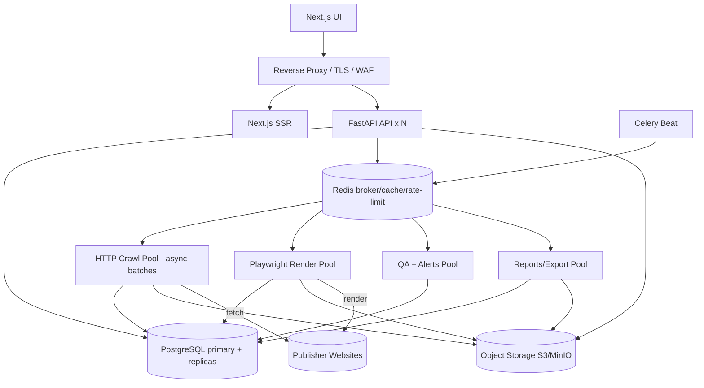
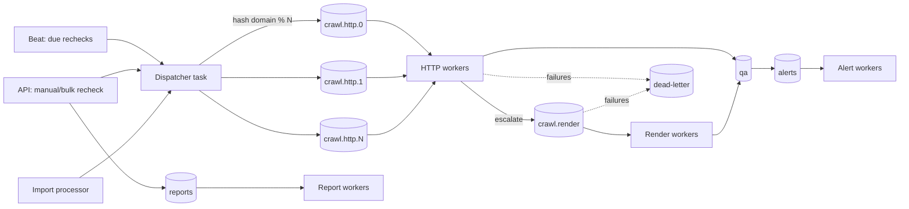
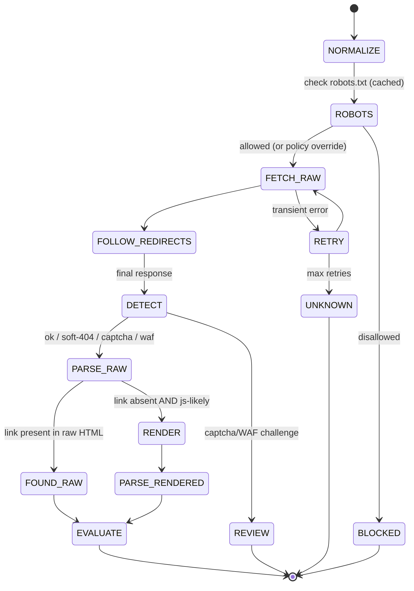
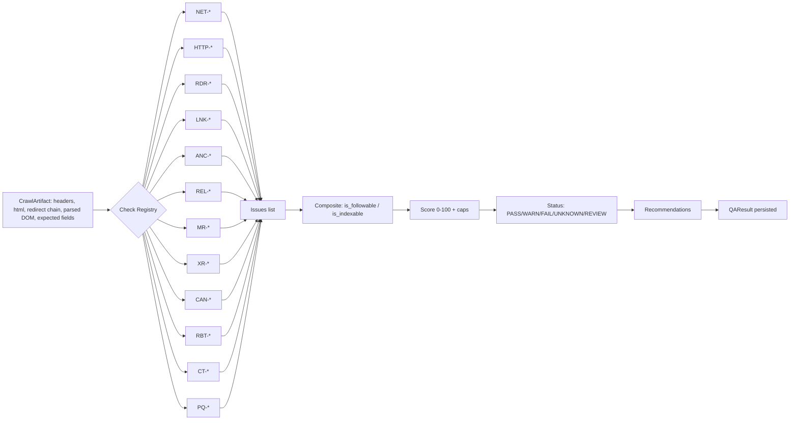
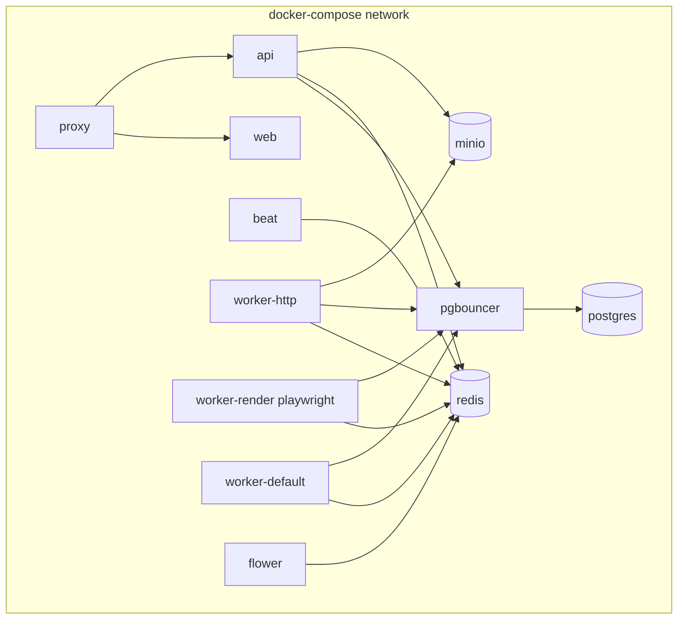

# LinkSentinel — Step 2: System Architecture

| Field | Value |
|---|---|
| **Document** | System Architecture |
| **Version** | 1.0 |
| **Date** | 2026-06-16 |
| **Deliverable** | Step 2 of 10 |
| **Builds on** | [Step 1 — PRD](01-product-requirements.md) |

---

## 1. Architecture Principles

1. **Modular monolith API + independently-scaled worker fleet.** The crawl/QA workload is what scales (1M+ links); the API surface is modest. We do **not** start with microservices — that adds network hops, distributed transactions, and ops cost we don't need yet. The backend is a single FastAPI codebase with clean module boundaries (`auth`, `projects`, `backlinks`, `crawl`, `qa`, `reports`, `alerts`), and the **crawler is a reusable library** consumed by both API (single recheck) and workers (bulk).
2. **Stateless services, stateful infrastructure.** API and workers hold no local state; all state lives in Postgres, Redis, and object storage. Any instance can serve any request / run any job → trivial horizontal scaling and zero-downtime deploys.
3. **Tiered, polite crawling.** Cheap async HTTP first; escalate to headless rendering only when justified. Per-domain rate limiting and robots.txt awareness are non-negotiable (PRD §9.6).
4. **Everything explainable & idempotent.** Each crawl is reproducible; each QA verdict carries evidence; re-running a job produces the same persisted state (safe retries).
5. **Separate the hot path from the heavy path.** Light HTTP crawling, headless rendering, report generation, and alerting run in **separate worker pools / queues** so a flood of one never starves the others.

---

## 2. High-Level Topology

```
                              ┌──────────────────────────┐
   Users                      │        Browser           │
   Admin / Manager /          │   Next.js UI (React/TS)  │
   QA / Viewer / Client       └─────────────┬────────────┘
                                             │ HTTPS
                              ┌──────────────▼────────────┐
                              │  Edge: Reverse Proxy + TLS │  Nginx / Traefik
                              │  routing · gzip · rate-limit│
                              └───────┬───────────────┬────┘
                       ┌──────────────┘               └─────────────┐
                ┌──────▼──────┐                              ┌───────▼───────┐
                │  Next.js    │  SSR / RSC                   │  FastAPI API  │  x N (stateless)
                │  web node   │                              │  (uvicorn/    │
                └─────────────┘                              │   gunicorn)   │
                                                             └──┬────┬────┬──┘
                  ┌─────────────────────────────────────────────┘    │    └───────────────┐
                  │                                                   │                    │
          ┌───────▼────────┐                              ┌───────────▼───────┐   ┌────────▼────────┐
          │  PostgreSQL    │   system of record           │      Redis        │   │ Object Storage  │
          │  primary +     │◄──── PgBouncer (pooling) ────►│ broker · cache ·  │   │  S3 / MinIO     │
          │  read replicas │                              │ token buckets ·   │   │ HTML snapshots, │
          │  (partitioned) │                              │ result backend    │   │ report files    │
          └───────▲────────┘                              └──┬─────────┬──────┘   └────────▲────────┘
                  │                                          │         │                   │
                  │                                  ┌───────▼──┐  ┌───▼───────────┐        │
                  │                                  │Celery Beat│  │ Celery Workers │       │
                  │                                  │(scheduler)│  │  (fleet)       │       │
                  │                                  └──────────┘  └──┬──┬──┬──┬─────┘        │
                  │                                                   │  │  │  │              │
                  │        ┌──────────────────────────────────────────┘  │  │  └──────────┐  │
                  │        │                ┌─────────────────────────────┘  │             │  │
                  │  ┌─────▼──────┐  ┌──────▼───────┐  ┌──────────────────┐ ┌▼───────────┐ │  │
                  └──┤ HTTP crawl │  │  Playwright  │  │  QA eval + alerts│ │ Reports /  ├─┘  │
                     │ pool       │  │  render pool │  │  pool            │ │ exports    ├────┘
                     │ (asyncio   │  │  (browsers)  │  │                  │ │ pool       │
                     │  batches)  │  └──────┬───────┘  └──────────────────┘ └────────────┘
                     └─────┬──────┘         │
                           │ fetch          │ render
                           ▼                ▼
                 ┌─────────────────────────────────────┐
                 │   Publisher websites (source pages)  │  ← egress via SSRF-guarded proxy
                 └─────────────────────────────────────┘

   Cross-cutting: Flower (Celery UI) · Prometheus + Grafana (metrics) · Loki/ELK (logs) · Sentry (errors)
```



---

## 3. Component Inventory

| # | Component | Tech | Responsibility | Scales by | State |
|---|---|---|---|---|---|
| 1 | **Web UI** | Next.js (App Router), React, TS, Tailwind, TanStack Query/Table, shadcn/ui | All persona UIs; SSR for first paint, CSR for grids | replicas behind proxy | none |
| 2 | **Edge proxy** | Nginx or Traefik | TLS termination, routing (`/` → web, `/api` → API), gzip/brotli, IP rate-limit, security headers | vertical/replicas | none |
| 3 | **API service** | FastAPI + Pydantic v2 + SQLAlchemy 2.0 async, gunicorn+uvicorn workers | REST API, authN/Z, validation, enqueues jobs, serves dashboards/exports | replicas (stateless) | none |
| 4 | **PostgreSQL** | Postgres 16 + PgBouncer | System of record; partitioned `crawl_results`/`backlink_history`; matviews | primary + read replicas; partitioning | durable |
| 5 | **Redis** | Redis 7 | Celery broker + result backend, per-domain token buckets, robots.txt cache, dashboard cache, idempotency keys | cluster/replica | ephemeral/cache |
| 6 | **Object storage** | S3 / MinIO | Raw HTML snapshots, rendered DOM, report files (CSV/XLSX/PDF), import uploads | managed/replicated | durable (blobs) |
| 7 | **HTTP crawl pool** | Celery worker running internal `asyncio` + httpx | Fetch source/target pages (raw), redirect chains, robots.txt, run QA | add worker replicas | none |
| 8 | **Render pool** | Celery worker + Playwright/Chromium | JS-rendered fetch when escalated; capture rendered DOM | add replicas (memory-bound) | none |
| 9 | **QA/Alerts pool** | Celery worker | Standalone QA re-eval, change-detection, dispatch notifications (email/Slack/webhook) | replicas | none |
| 10 | **Reports pool** | Celery worker | Generate CSV/XLSX/PDF, large exports, scheduled reports | replicas | none |
| 11 | **Maintenance pool** | Celery worker | Matview refresh, retention/cleanup, snapshot pruning, DLQ reprocessing | 1–2 | none |
| 12 | **Celery Beat** | Celery beat (+ Redbeat for HA) | Cron scheduling: daily/weekly/monthly rechecks, matview refresh, cleanup | singleton (HA lock) | schedule in Redis |
| 13 | **Flower** | Flower | Celery monitoring/inspection | 1 | none |
| 14 | **Metrics/Logs/Errors** | Prometheus+Grafana, Loki/ELK, Sentry | Observability | managed | TSDB/logs |

---

## 4. Backend (FastAPI) Internal Structure

A modular monolith — clear domains, shared kernel, no premature service split:

```
backend/app/
├── main.py                 # FastAPI app factory, middleware, routers
├── core/                   # config, security (JWT/Argon2), deps, RBAC, logging, errors
├── db/                     # SQLAlchemy async engine, session, base, PgBouncer-aware pooling
├── models/                 # ORM models (users, workspaces, projects, backlinks, crawl_*, issues, history, ...)
├── schemas/                # Pydantic v2 request/response models
├── api/v1/                 # routers: auth, workspaces, projects, backlinks, imports, crawl, results, dashboard, reports, alerts, notifications, settings
├── services/               # business logic (project_service, import_service, crawl_service, qa_service, report_service, alert_service)
├── crawler/                # REUSABLE library (see §8) — fetch, normalize, parse, detect
├── qa/                     # REUSABLE QA engine — check registry, scoring, classification, recommendations
├── workers/                # Celery app, task definitions, queues, beat schedule
├── integrations/           # email, slack, webhook, (future) ahrefs/semrush/gsc
└── reports/                # CSV/XLSX/PDF renderers
```

- **`crawler/` and `qa/` are pure libraries** (no FastAPI/Celery imports) → reused by the API for a single live recheck and by workers for bulk. This satisfies PRD "make the crawler engine reusable" and "every QA check explainable."
- **AuthZ** is a FastAPI dependency: resolves `current_user` → `workspace_id` → role → optional project membership; injected into every route; every mutation writes `audit_logs`.
- **Read replica routing:** read-only endpoints (dashboard, table, detail) use a replica session; writes use primary. SQLAlchemy session chosen by route flag.

---

## 5. Worker Fleet & The Async-on-Celery Design

### 5.1 The core problem
The crawler is **async I/O-bound** (httpx/Playwright); Celery is **process/thread, sync-first**. Naively running one URL per Celery task wastes the event loop and floods the broker at 1M scale.

### 5.2 The design: batch tasks that run an internal asyncio crawl
A crawl task receives a **batch of backlink IDs** (e.g., 50–200) and runs them concurrently inside one event loop, bounded by a **per-domain semaphore** and a **global concurrency cap**:

```python
# workers/tasks/crawl.py  (shape, not full impl — that's Step 5/6)
@celery_app.task(bind=True, acks_late=True, max_retries=3,
                 autoretry_for=(TransientError,), retry_backoff=True, retry_jitter=True)
def crawl_batch(self, backlink_ids: list[int]):
    # one event loop per task; amortizes startup, gives high concurrency per process
    return asyncio.run(_crawl_batch_async(backlink_ids, job_id=self.request.id))

async def _crawl_batch_async(ids, job_id):
    async with CrawlEngine(global_limit=settings.CRAWL_GLOBAL_CONCURRENCY) as engine:
        # engine internally enforces per-domain token buckets + crawl-delay
        await asyncio.gather(*(engine.process_backlink(i) for i in ids),
                             return_exceptions=True)   # partial-result safe
```

- **`acks_late=True`** + idempotent writes → a crashed worker re-runs the batch safely (at-least-once + dedup on `crawl_results`).
- **`return_exceptions=True`** → one failing link never fails the batch (partial-result saving, PRD §32).
- **Batch sizing** is dynamic: smaller for render jobs, larger for light HTTP.

### 5.3 Worker pools (separate processes, separate queues)
| Pool | Queue | Concurrency model | Why separate |
|---|---|---|---|
| **HTTP crawl** | `crawl.http.<shard>` | 1 process, high async concurrency (100–300 in-flight) | I/O-bound; cheap; the bulk of work |
| **Render** | `crawl.render` | prefork, **low** concurrency (1 browser ctx per slot, 4–8/worker) | Chromium is CPU+RAM heavy (~300–500 MB/ctx); must be isolated/capped |
| **QA/alerts** | `qa`, `alerts` | thread/async | CPU-light; must stay responsive for regressions |
| **Reports** | `reports` | prefork | XLSX/PDF generation is CPU/memory spiky |
| **Maintenance** | `maintenance` | 1–2 | Matview refresh, cleanup, DLQ replay |

### 5.4 Celery vs. arq — the decision
| Criterion | Celery (chosen, per PRD) | arq (alternative) |
|---|---|---|
| Async-native | No (we wrap with `asyncio.run` per batch) | Yes (tasks are coroutines) |
| Ecosystem/maturity | Very mature; Flower, beat, routing | Lighter, fewer integrations |
| Scheduling | beat (+RedBeat HA) | cron support, simpler |
| Fit for our shape | **Good** with batch pattern | **Excellent** for pure-async crawling |
| **Verdict** | **Default — meets the spec, batch pattern removes the async penalty.** | Documented migration path; swap `workers/` only — `crawler/`+`qa/` libraries are framework-agnostic so the port is mechanical. |

> Because `crawler/` and `qa/` are framework-free libraries, moving from Celery to arq (or Dramatiq) later touches only `workers/` — a contained change.

---

## 6. Queue Architecture



**Routing & ordering:**
- **Domain sharding:** the dispatcher routes a backlink to `crawl.http.<hash(registrable_domain) % N>`. All URLs of one domain land on a consistent shard → per-domain rate limiting and politeness are local and contention-free; no thundering herd on a single host.
- **Priority:** manual/single rechecks use a high-priority routing key; scheduled bulk uses normal; the broker honors priority within a queue.
- **Backpressure:** dispatcher checks queue depth (Redis `LLEN`) and the domain's token bucket before enqueuing more; if a domain is saturated, its links get a deferred `eta`.
- **Dead-letter queue:** after `max_retries`, the task payload + last error go to `dead-letter`; the maintenance pool exposes/admin-replays them.

---

## 7. Rate Limiting, Politeness & Resilience

| Mechanism | Implementation | Purpose |
|---|---|---|
| **Per-domain token bucket** | Redis Lua script: `key=rl:{domain}`, refill `rate`/s, capacity `burst` | Never exceed N req/s to one host (default conservative, e.g. 0.5–2 r/s) |
| **Crawl-delay** | Honor robots.txt `crawl-delay`; overrides token rate if larger | Respect publisher's stated limit |
| **Per-domain concurrency** | asyncio `Semaphore` per domain inside engine | Cap simultaneous in-flight to one host |
| **Global concurrency cap** | engine-level semaphore + worker `--concurrency` | Protect our own egress/CPU |
| **Retries** | exp backoff + jitter, `max_retries=3`, only on transient (timeouts, 429, 503, conn reset) | Recover without hammering |
| **Per-domain circuit breaker** | Redis counter: after K consecutive failures, open circuit for cooldown T | Stop pounding a down/blocking host; auto-mark links UNKNOWN/REVIEW |
| **Response-size cap** | stream + abort > N MB; reject decompression bombs | Memory safety |
| **Timeouts** | separate connect/read timeouts | Bounded latency |

---

## 8. Crawler Library — Tiered Fetch Pipeline

The reusable `crawler/` engine; same code path for one link or a million.



**Stages:** (1) **Normalize** URL (PRD §8.4). (2) **Robots** — fetch+cache robots.txt (Redis, TTL ~24h), evaluate for Googlebot. (3) **Fetch raw** via httpx (configurable UA, timeouts, SSRF guard §14). (4) **Follow redirects** manually, recording each hop (URL, status); detect loops/excessive hops; SSRF-recheck each hop's resolved IP. (5) **Detect** content-type, soft-404 heuristics, CAPTCHA/Cloudflare/WAF signatures, empty/parked. (6) **Parse raw** (lxml) → headers (X-Robots), meta robots, canonical, links, anchor, rel, page-quality. (7) **Escalate to render** only if link absent in raw AND page is JS-likely (framework markers, low text + script-heavy) → Playwright fetches rendered DOM; record `raw` vs `rendered`. (8) **Persist** raw HTML to object storage (pointer in DB), full metadata to Postgres. (9) Hand the parsed artifact to the **QA engine**.

---

## 9. QA Evaluation Pipeline

The reusable `qa/` engine consumes a `CrawlArtifact` and produces a verdict — a **registry of independent check functions** so checks are testable and extensible (PRD §8.6).



Each check returns zero or more `Issue{code, label, category, severity, message, recommendation, evidence}`. The engine then computes composite booleans (§8.7 of PRD), the deterministic score with hard caps (§8.8), the status (§8.9), and aggregates recommendations. **Pure functions → fully unit-testable** (Step 9).

---

## 10. Database Architecture

- **Engine:** PostgreSQL 16, async via `asyncpg`/SQLAlchemy 2.0, fronted by **PgBouncer** (transaction pooling) so thousands of worker coroutines don't exhaust Postgres connections.
- **Primary + read replicas:** writes → primary; dashboard/table/detail reads → replica. Replica lag tolerated for analytics.
- **Partitioning (the scale lever):**
  - `crawl_results` → **RANGE partition by month** on `crawled_at` (1M daily rechecks = ~30M rows/month; old partitions detached/archived).
  - `backlink_history` → **RANGE partition by month** on `created_at`.
  - `backlink_records` → optionally **HASH partition by `workspace_id`** at very large multi-tenant scale.
- **Matviews for dashboards:** `mv_project_dashboard`, `mv_vendor_failure_rates`, `mv_domain_failures` refreshed incrementally by the maintenance pool (every 1–5 min) → sub-2s dashboard loads without scanning fact tables.
- **Indexes (per PRD §28):** `project_id`, normalized `source_url`, normalized `target_url`, `domain`, `status`, `score`, `last_checked_at`, `next_check_at`, `issue_type`; composite `(project_id, status, score)` for the table grid; partial index `WHERE status='FAIL'` for fast failure views.
- **Keyset pagination:** the backlink grid pages by `(score, id)` or `(last_checked_at, id)` cursors — constant-time at 1M rows (no `OFFSET` scans).
- **Object storage offload:** raw/rendered HTML is **not** in Postgres — only a pointer (`raw_html_key`) — keeping the DB lean.

---

## 11. Caching Strategy (Redis)

| Cache | Key | TTL | Purpose |
|---|---|---|---|
| robots.txt | `robots:{scheme}:{host}` | 12–24h | Avoid refetch per link on same host |
| DNS / IP allow-decision | `dns:{host}` | 5–15m | Speed + SSRF decision reuse |
| Dashboard aggregates | `dash:{project_id}` | 60s (or matview-backed) | Burst protection |
| Token buckets | `rl:{domain}` | rolling | Rate limiting |
| Idempotency | `idem:{job_id}` | job TTL | Dedup at-least-once tasks |
| Auth refresh denylist | `jwt:revoked:{jti}` | token TTL | Logout/rotation |

---

## 12. Data Flow: Import → Final QA Report (end-to-end)

```mermaid
sequenceDiagram
  autonumber
  participant U as User (QA)
  participant API as FastAPI
  participant PG as PostgreSQL
  participant OS as Object Storage
  participant RD as Redis/Queue
  participant IW as Import worker
  participant CW as Crawl worker
  participant RW as Render worker
  participant EXT as Publisher site
  participant AW as Alert worker
  participant RPW as Report worker

  U->>API: POST /imports (CSV/XLSX) + column mapping
  API->>OS: store raw upload
  API->>PG: create import (status=pending) + import_rows (staging)
  API->>RD: enqueue import.process
  API-->>U: 202 import_id (poll progress)

  IW->>PG: read import_rows
  IW->>IW: validate + URL-normalize + dedup (per project)
  IW->>PG: upsert backlink_records; write row errors; status=partial/completed
  IW->>RD: enqueue crawl batches (domain-sharded), set next_check_at

  loop per due backlink (rate-limited per domain)
    CW->>RD: acquire domain token (else defer with eta)
    CW->>EXT: robots.txt (cached) + HTTP GET raw
    EXT-->>CW: response + headers
    alt link absent in raw AND JS-likely
      CW->>RD: enqueue crawl.render
      RW->>EXT: headless render
      EXT-->>RW: rendered DOM
      RW->>OS: store rendered snapshot
    end
    CW->>OS: store raw HTML snapshot
    CW->>CW: run QA checks -> issues + score + status
    CW->>PG: insert crawl_results + backlink_issues; update backlink_records (status/score/last_checked_at)
    CW->>PG: diff vs previous -> insert backlink_history events
    alt regression detected (e.g., dofollow->nofollow, link removed, score drop)
      CW->>RD: enqueue alert
      AW->>PG: insert notification
      AW->>EXT: (email / Slack webhook / generic webhook)
    end
  end

  Note over PG: maintenance pool refreshes dashboard matviews

  U->>API: GET /dashboard, /backlinks (filter/sort/keyset)
  API->>PG: read replica (matviews + indexed queries)
  API-->>U: stats + grid

  U->>API: POST /reports (client/campaign/vendor/monthly, format=pdf)
  API->>PG: create report (status=pending)
  API->>RD: enqueue report.generate
  RPW->>PG: query results + issues + recommendations
  RPW->>OS: write CSV/XLSX/PDF
  RPW->>PG: report status=completed + file key
  U->>API: GET /reports/{id}/download
  API->>OS: signed URL
  API-->>U: download
```

**Stage summary:** Upload → stage → validate/normalize/dedup → persist records → domain-sharded enqueue → rate-limited raw fetch → (conditional render) → snapshot to object storage → QA evaluate (issues/score/status) → persist results + history diff → alert on regression → matview refresh → dashboards/grid from replica → on-demand report job → signed download. Every arrow is idempotent and resumable; a crash resumes from the last persisted stage.

---

## 13. Scaling Strategy (10k / 100k / 1M+)

**Throughput model (sizing math):**
- One HTTP crawl worker process sustains ~**100–300 concurrent** fetches; at ~2s average fetch that's **~50–150 links/sec/worker** (politeness caps per domain, not aggregate).
- Daily recheck of **1M** links over an **8h window** = 1,000,000 / 28,800s ≈ **~35 links/sec sustained** → comfortably **1–2 HTTP workers**, provision **4–6** for retries, spikes, and headroom.
- **Render** is the expensive path: ~**1–2 pages/sec/worker** (4–8 browser ctx). If ~**10%** need rendering = 100k/day over 8h ≈ **~3.5 renders/sec** → **2 render workers** minimum, provision **4–6**.

| Tier | Postgres | Redis | HTTP workers | Render workers | Key techniques |
|---|---|---|---|---|---|
| **10k** | single instance | single | 1 | 1 | defaults; no partitioning needed |
| **100k** | primary + 1 replica, monthly partitions | single (persistent) | 2–4 | 2 | batch inserts, per-domain token buckets, matviews, separate render pool |
| **1M+** | primary + 2+ replicas, PgBouncer, monthly partitions (+ optional workspace hash), archival | Redis cluster | 4–8 (autoscale on queue depth) | 4–6 (autoscale) | **queue sharding by domain hash**, object-storage HTML, incremental matviews, keyset pagination, retention/cleanup jobs, optional **ClickHouse** for analytics, **HPA** on queue depth + CPU |

**Autoscaling signal:** Celery queue depth (`crawl.http.*` backlog) and worker CPU → KEDA/HPA scales worker replicas; API scales on RPS/CPU. Postgres scales by adding read replicas and detaching old partitions to cold storage.

---

## 14. Security Architecture

- **SSRF defense (critical — users submit arbitrary crawl URLs):**
  - Allow only `http`/`https` schemes.
  - Resolve DNS, then **block private/reserved ranges**: `127.0.0.0/8`, `10/8`, `172.16/12`, `192.168/16`, `169.254/16` (incl. cloud metadata `169.254.169.254`), `::1`, `fc00::/7`, `fe80::/10`.
  - **Re-validate every redirect hop's resolved IP** (no redirect-to-internal bypass).
  - Run crawl workers behind a **dedicated egress proxy / restricted network** that enforces the allowlist at the network layer (defense in depth).
  - Cap response size and total time; reject decompression bombs.
- **AuthN/Z:** Argon2id password hashing; short-lived JWT access + rotating refresh; `jti` denylist on logout; RBAC dependency + **tenant isolation** (`workspace_id` filter injected into every query) + project membership scoping for Viewers.
- **Secrets:** env/Docker secrets in dev; AWS Secrets Manager / Vault in prod; integration creds (Slack/SMTP/API keys) encrypted at rest (app-level KMS envelope encryption).
- **Transport:** TLS everywhere; HSTS; secure cookies for refresh token (httpOnly, SameSite).
- **Input validation:** Pydantic v2 on every endpoint; file-type/size limits on imports.
- **Audit:** every mutation and auth event → `audit_logs` (who/what/when/before/after).
- **Abuse controls:** per-IP and per-user API rate limiting at the edge + app layer.

---

## 15. Observability & SRE

- **Metrics (Prometheus):** crawl rate, success/fail %, per-domain throttle hits, queue depth per queue, render escalation %, task latency histograms, DB pool saturation, matview refresh lag. Grafana dashboards + alerts.
- **Logs:** structured JSON with `correlation_id` (request → enqueued task → crawl) shipped to Loki/ELK.
- **Tracing:** OpenTelemetry spans across API → task → crawl (optional, enterprise).
- **Errors:** Sentry for API + workers.
- **Celery:** Flower for live inspection; alerts on DLQ growth and stuck queues.
- **SLOs:** API P95 < 300ms; scheduled-run completion 100% within window; crawl success ≥ 97% (excluding bot-blocked).

---

## 16. Failure Handling & Resilience

| Failure | Handling |
|---|---|
| Transient fetch error (timeout/429/503/reset) | exp-backoff retry ≤3; then mark `UNKNOWN`, reschedule sooner |
| Worker crash mid-batch | `acks_late` + idempotent writes → batch re-runs safely; partial results already persisted |
| Host down / blocking repeatedly | per-domain circuit breaker opens; links → UNKNOWN/REVIEW; auto-retry after cooldown |
| Render pool saturated | graceful degradation → serve raw-only verdict + flag `JS_RENDER_REQUIRED` for later re-eval |
| Postgres primary failover | PgBouncer reconnect; workers retry with backoff; jobs idempotent |
| Poison job (always fails) | after max retries → dead-letter queue; admin replay |
| Large import interrupted | staging rows + per-row status → resume from last unprocessed row |
| Redis blip | broker reconnect; token buckets fail-open conservatively (default-deny burst) |

---

## 17. Deployment Topology

### 17.1 Dev / single node — Docker Compose (Step 8 delivers this)
Services: `proxy` (nginx), `web` (next), `api` (fastapi), `db` (postgres), `pgbouncer`, `redis`, `minio`, `worker-http`, `worker-render` (playwright image), `worker-default` (qa/alerts/reports/maintenance), `beat`, `flower`. One command (`docker compose up`) brings up the whole platform with seed data.



### 17.2 Production — Kubernetes (enterprise upgrade, roadmap)
- Deployments: `api` (HPA on CPU/RPS), `web`, `worker-http` (KEDA on queue depth), `worker-render` (KEDA, memory-bounded node pool), `worker-default`, `beat` (single replica + leader lock via RedBeat).
- Managed **RDS/Cloud SQL Postgres** (+ read replicas) and **ElastiCache Redis**; **S3** for blobs.
- Ingress + cert-manager (TLS); NetworkPolicies isolate worker egress through the SSRF proxy; secrets via External Secrets/Vault.
- Blue/green or rolling deploys; migrations run as a pre-deploy Job (Alembic).

---

## 18. Configuration & Environments

Single typed settings module (Pydantic `BaseSettings`), 12-factor env vars: DB/Redis/S3 URLs, JWT secrets/TTLs, crawl defaults (UA, timeouts, retries, global concurrency, per-domain rate, max redirects, render-escalation thresholds, response-size cap), robots-respect toggle, retention windows, integration creds, feature flags. Environments: `dev` (Compose + MinIO), `staging`, `prod` (managed services). Full env reference ships in Step 10.

---

## 19. Architecture Decision Record (summary)

| # | Decision | Rationale | Alternatives rejected |
|---|---|---|---|
| ADR-1 | Modular monolith API + worker fleet | Only crawl scales; avoid microservice tax | Microservices (premature) |
| ADR-2 | Celery with internal asyncio batches | Meets PRD stack; batch removes async penalty | One-task-per-URL (broker flood); pure threads (GIL on I/O fine but loses concurrency efficiency) |
| ADR-3 | Separate render pool | Chromium RAM/CPU isolation; protect hot path | Single mixed pool (render starves HTTP) |
| ADR-4 | Domain-sharded queues | Local, contention-free per-domain politeness | Single queue (host hammering, hard rate-limit) |
| ADR-5 | HTML snapshots in object storage | Keep Postgres lean at 1M+ | HTML in Postgres (bloat, vacuum pain) |
| ADR-6 | Partition + matviews + keyset | Sub-2s dashboards & grids at 1M | OFFSET pagination + live aggregates (slow) |
| ADR-7 | SSRF egress proxy + IP allowlist | Users submit arbitrary URLs → real risk | Trust user URLs (vulnerable) |
| ADR-8 | `crawler/` + `qa/` as framework-free libs | Reuse in API & workers; enables arq port | Coupling to Celery/FastAPI |

---

### ✅ End of Step 2
**Next: Step 3 — Database Schema:** full PostgreSQL DDL for all tables in PRD §28 (users, workspaces, roles/members, projects, vendors, campaigns, backlink_records, crawl_jobs, crawl_results, backlink_issues, backlink_history, notifications, alert_rules, reports, imports/import_rows, settings, audit_logs), with constraints, enums, foreign keys, **partitioning**, all required **indexes**, matview definitions, and an entity-relationship diagram.
